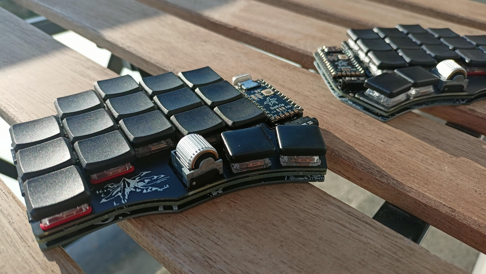

# Arkenswoop

A WIP fork of [jimmerricks's Swoop](https://github.com/jimmerricks/swoop), which is a fork of [David Barr's Sweep](https://github.com/davidphilipbarr/Sweep), which is itself based on the fabulous [Ferris by Pierre Chevalier](https://github.com/pierrechevalier83/ferris).

| Front | Back |
| :---: | :---: |
|  |  |

### Features

⭕ Low profile Kailh Choc switches  
⭕ Hotswap  
⭕ Dual side-scrolling encoder  
⭕ Oled screens  
⭕ Power switch for battery management  
⭕ Bluetooth support w/ nice!nano  
⭕ Plate style case with mcu cover

### Components list

To build and use an Arkenswoop you will need:

* 1× PCB Kit (1.6mm thickness when ordering)
* 1× back plate kit (optional, 1.2mm thickness when ordering)
* 2× promicro compatible boards or 2 nice!nanos.
* 34× Kailh Choc v1 switches
* 34× Kailh Choc hotswap sockets (PG1350)
* 34× keycaps
* 34× SMD diodes (1N4148W, SOD-123)
* 2× side-scrolling encoders EVQWGD001
* 2× OLED LCD Display 128x32 SSD1306 (optional)
* 2× MCU cover (optional, 1mm thickness when ordering)
* 2× reset switches (optional; B3U-1000P(M))
* Some little rubber feet/bumpers (minimum of 4 on each side)
* 2× power switches (wireless only; MSK 12C02)
* 2× lipo batteries (wireless only; 301230 or 301228)
* 1× TRRS (not TRS!) cable (wired only)
* 2× TRRS Jack [PJ-320A] (wired only)
* 1× USB Cable (depends on your micro-controller choice)

## Images

    
Assembled Arkenswoop 0.6.0

    

    
Back of assembled Arkenswoop 0.6.0

    

# Altenswoop

An Arkenswoop inspired keyboard with a twist: the Z and / keys are moved to the side.

| Front | Back |
| :---: | :---: |
|  |  |

### Features

⭕ Low profile Kailh Choc switches  
⭕ Hotswap  
⭕ Dual side-scrolling encoder  
⭕ Oled screens  
⭕ Power switch for battery management  
⭕ Bluetooth support w/ nice!nano  
⭕ Plate style case with mcu cover

### Components list

To build and use an Altenswoop you will need:

* 1× PCB Kit (1.6mm thickness when ordering)
* 1× back plate kit (optional, 1.2mm thickness when ordering)
* 2× promicro compatible boards or 2 nice!nanos.
* 34× Kailh Choc v1 switches
* 34× Kailh Choc hotswap sockets (PG1350)
* 34× keycaps
* 34× SMD diodes (1N4148W, SOD-123)
* 2× side-scrolling encoders EVQWGD001
* 2× OLED LCD Display 128x32 SSD1306 (optional)
* 2× MCU cover (optional, 1mm thickness when ordering)
* 2× reset switches (optional; B3U-1000P(M))
* Some little rubber feet/bumpers (minimum of 4 on each side)
* 2× power switches (wireless only; MSK 12C02)
* 2× lipo batteries (wireless only; 301230 or 301228)
* 1× TRRS (not TRS!) cable (wired only)
* 2× TRRS Jack [PJ-320A] (wired only)
* 1× USB Cable (depends on your micro-controller choice)

