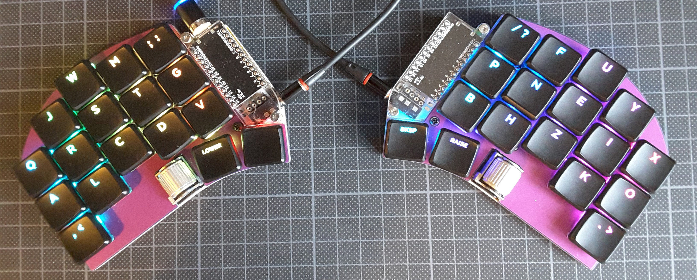
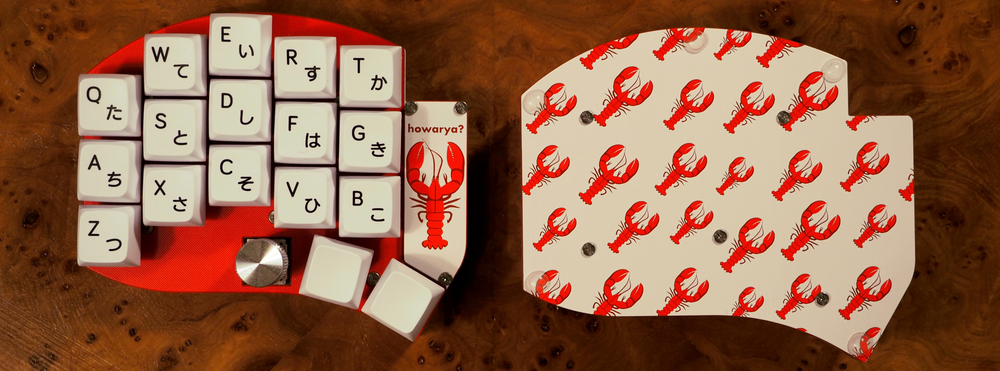

# Swoop

A WIP fork of [David Barr's Sweep](https://github.com/davidphilipbarr/Sweep), which is itself based on the fabulous [Ferris by Pierre Chevalier](https://github.com/pierrechevalier83/ferris).

There are two editions of the Swoop.

  
  

## Swoop LP 🦀

| Front | Back |
| :---: | :---: |
|  |  |

### Features
⭕ Low profile Kailh Choc switches  
⭕ Per-key RGB LEDs (mini-e)  
⭕ Dual side-scrolling encoder  
⭕ Oled screens  
⭕ Power switch for battery management  
⭕ Bluetooth support w/ nice!nano  
⭕ Plate style case with mcu cover

### Components list

To build and use a Swoop LP you will need:

* 1× PCB Kit
* 2× promicro compatible boards or 2 nice!nanos.
* 34× Kailh Choc v1 switches
* 34× SK6812 Mini-E RGB SMD Leds
* 34× keycaps
* 2× side-scrolling encoders
* 2× reset switches (optional; [B3U-1000P(M)](https://github.com/davidphilipbarr/Sweep/issues/20))
* Some little rubber feet/bumpers
* 2× power switches (wireless only; MSK 12C02)
* 2× lipo batteries (wireless only; 301230 or 301228)
* 1× TRRS (not TRS!) cable (wired only)
* 2× TRRS Jack [PJ-320A] (wired only)
* 1× USB Cable (depends on your micro-controller choice)

## Swoop MX / Howarya 🦞

| Front | Back |
| :---: | :---: |
|  |  |

### Features
⭕ Cherry MX style switches  
⭕ Hotswap support  
⭕ Per-key RGB LEDs (mini-e)  
⭕ Up to 2 encoders  
⭕ Oled screens  
⭕ Power switch for battery management  
⭕ Bluetooth support w/ nice!nano  
⭕ Plate style case with mcu cover

### Components list

To build and use a Swoop MX you will need:

* 1× PCB Kit
* 2× promicro compatible boards or 2 nice!nanos.
* 34-36× Cherry MX style switches
* 34-36× Kailh hotswap sockets
* 34-36× SK6812 Mini-E RGB SMD Leds (optional; not recommended for wireless)
* 34-36× keycaps
* 2× Rotary encoders & knobs (optional)
* 2× reset switches (optional; [B3U-1000P(M)](https://github.com/davidphilipbarr/Sweep/issues/20))
* Some little rubber feet/bumpers
* 2× power switches (wireless only; MSK 12C02)
* 2× lipo batteries (wireless only; 301230 or 301228)
* 1× TRRS (not TRS!) cable (wired only)
* 2× TRRS Jack [PJ-320A] (wired only)
* 1× USB Cable (depends on your micro-controller choice)
